# 🛒 E-commerce ASP.NET Core MVC Project

This is a fully functional e-commerce web application developed using ASP.NET Core MVC during my internship. The application provides a great user experience for customers and efficient management tools for administrators. The project is built with Entity Framework Core for database management and ASP.NET Core Identity for user authentication and authorization.

---

## 🛠️ Project Overview

- **Project Type:** E-commerce Web Application  
- **Technology Stack:** ASP.NET Core MVC, C#, SQL Server, Entity Framework Core, ASP.NET Core Identity  
- **Purpose:** To create a scalable e-commerce platform with role-based access control (Admin and Customer) and a secure user authentication system.  
- **Status:** Completed
  

---

## 💡 Key Features

### 🔐 Role-Based User Authentication
- **Admin:** Full control over the product catalog, customer orders, and user management.
- **Customer:** Browse products, add items to the cart, and place orders.

### 📦 Product Management
- Admins can easily add, edit, or delete products from the catalog.
- Products are managed using Entity Framework Core and stored in SQL Server.

### 🛒 Shopping Cart
- Customers can add items to their cart, modify quantities, and proceed to checkout.

### 📑 Order Management
- Customers can view their orders, and Admins can manage and process them.

### 🔐 User Authentication
- Secure user registration, login, and logout using ASP.NET Core Identity.

### 📱 Responsive Design
- Fully responsive UI across devices (desktop, tablet, and mobile) using Bootstrap.

### 🔒 Role-Based Authorization
- Admin and Customer roles have separate access rights to ensure security and proper functionality.

---

## 📁 Technologies Used

- **ASP.NET Core MVC** – Framework used for building the web application and handling routing and views  
- **C#** – Programming language for backend logic  
- **SQL Server** – Database system for storing products, orders, and user data  
- **Entity Framework Core** – ORM for managing database operations  
- **ASP.NET Core Identity** – User authentication and role-based authorization  
- **Razor Views** – For rendering dynamic pages  
- **Bootstrap** – Responsive and mobile-friendly UI  
- **Font Awesome** – Icons used throughout the application  

---
---

## 🚀 Live Demo

You can explore the live version of the e-commerce application here:

👉 [🔗 View Live Demo] (https://thingsandmore.runasp.net/) 

> 📝 *Note: The live demo may have limited functionality or sample data only.*

---

## 📸 Application Screenshots

Here’s a visual walkthrough of the application features from both Admin and Customer perspectives:

### 🔐 Admin Dashboard  
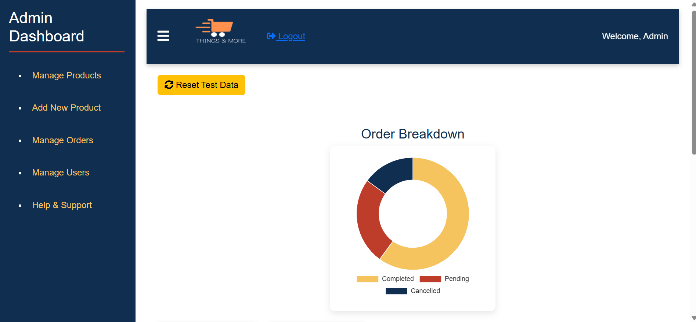

### 🏠 Admin Home
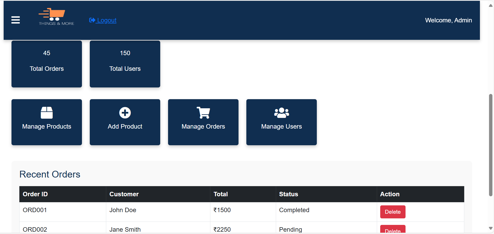

### 👥 Manage Users  
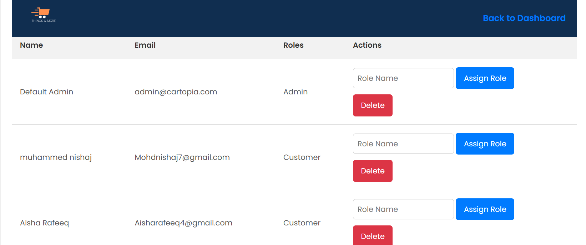

### ➕ Add Product  
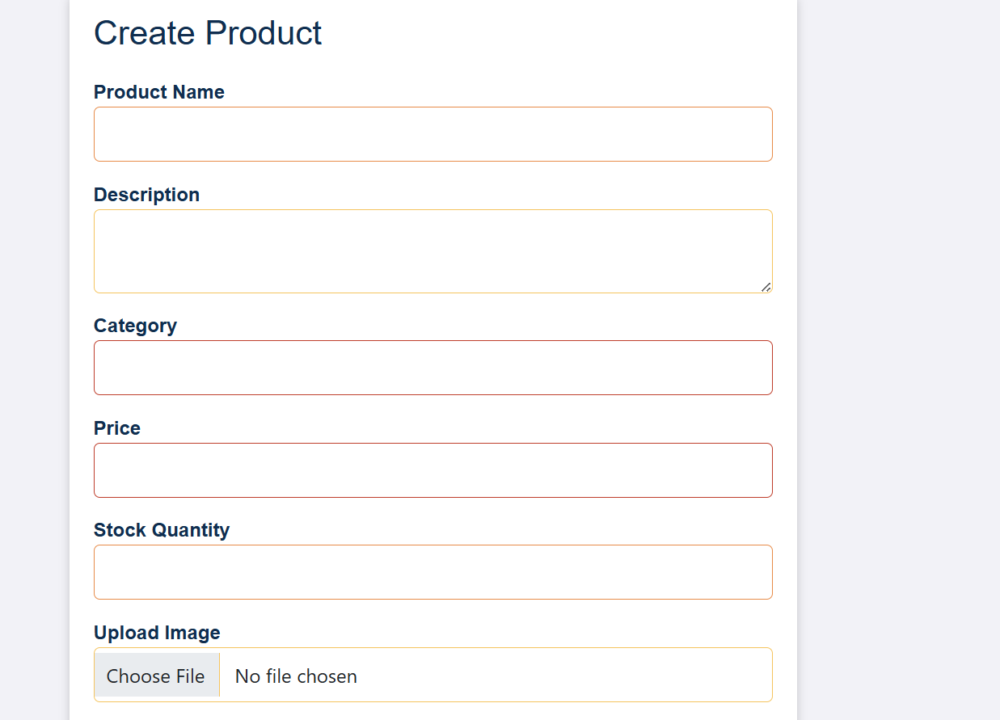

### 📦 Manage Orders  
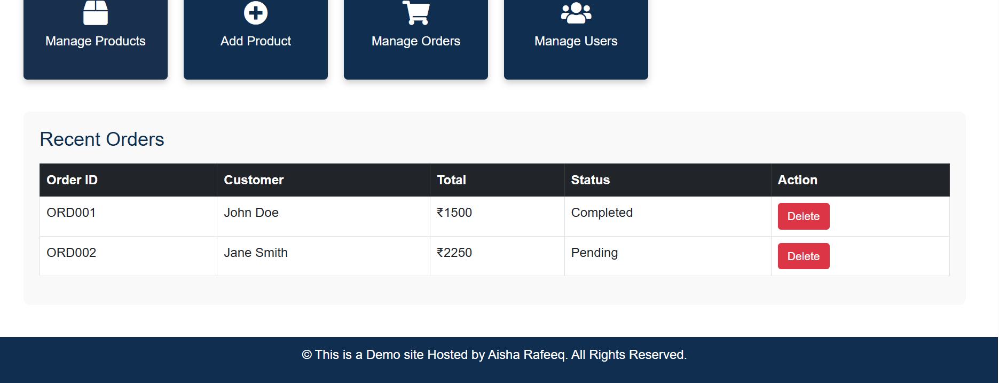

### 🏠 Customer Home  
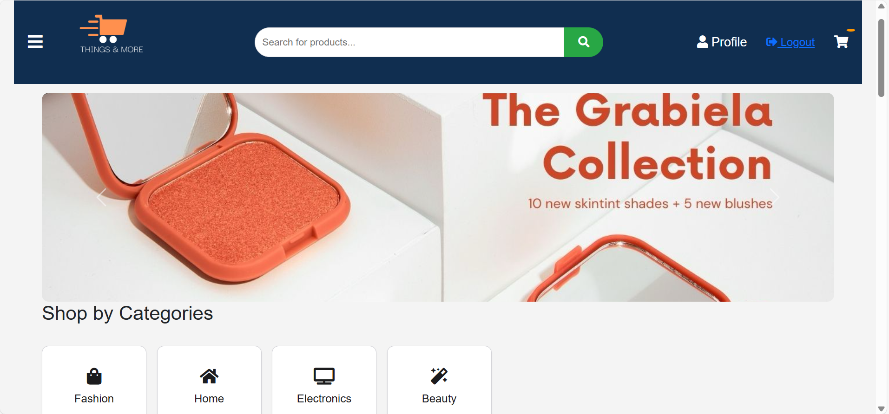

### 🛍️ Product View & Cart  
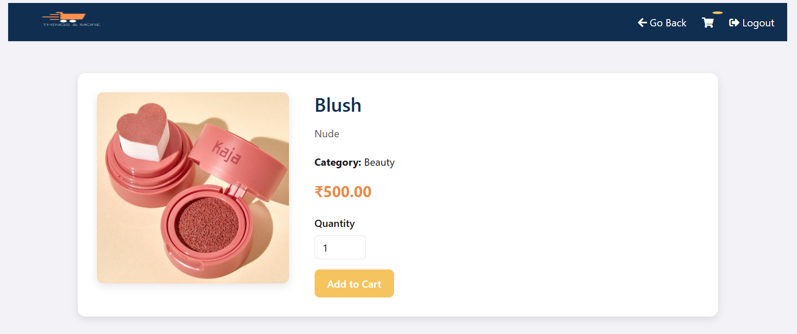  
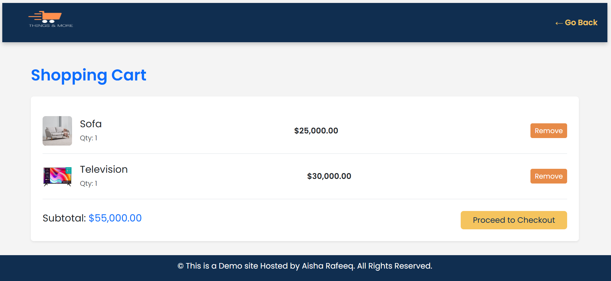

### 💳 Checkout & Order Summary  
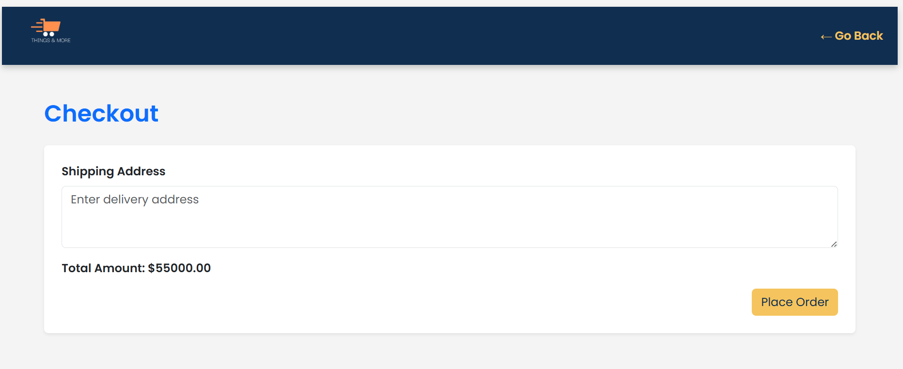  
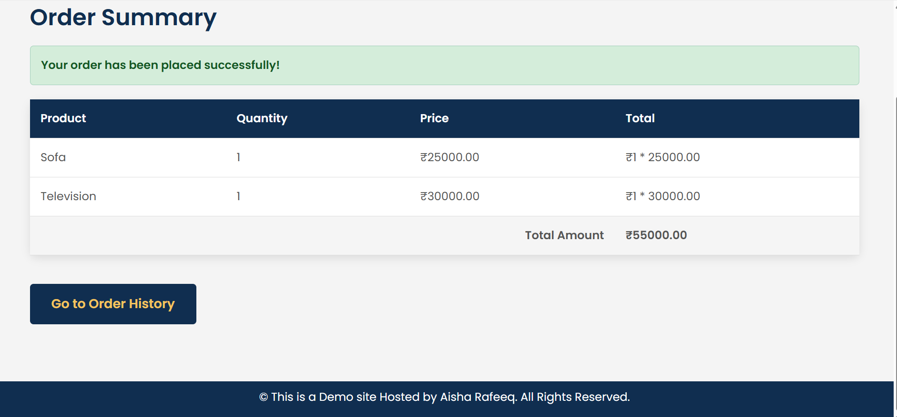

### 👤 Profile Management  
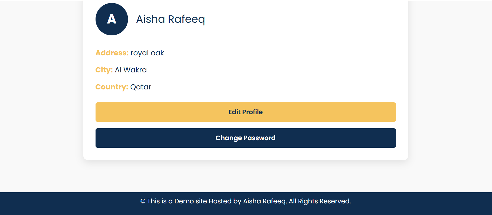

### 🌟 Featured Section  
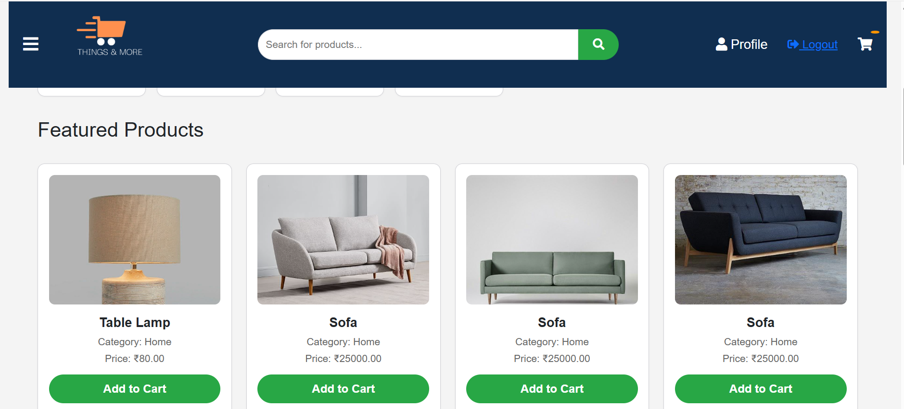

---

## 🚧 Project Status & Roadmap

The project is currently in its initial stages. Here are some future goals:

- 💳 Implement payment gateway (e.g., Stripe, PayPal)  
- 🎨 Improve UI and UX  

---

## 🤝 Contributing

Contributions to this project are welcome!  
If you find a bug or have an idea for a feature, feel free to open an issue or submit a pull request.

---

## 🙏 Acknowledgments

- [ASP.NET Core Documentation](https://learn.microsoft.com/en-us/aspnet/core/?view=aspnetcore-7.0)  
- [Entity Framework Core Documentation](https://learn.microsoft.com/en-us/ef/core/)  
- [Bootstrap 5](https://getbootstrap.com/)  
- [Font Awesome](https://fontawesome.com/)

---

